# AIX / OnDemand SRE — Technical Reference Guide
> Prepared by Harry Joseph | Banking Platform SRE | February 2026
> z/OS operational expertise maps directly to AIX — this document captures those equivalencies and production support patterns.

---

## 📋 RUNBOOKS

> This repository is built around operational runbooks for AIX / IBM Content Manager OnDemand (CMOD) environments in banking. The runbooks define the exact procedures used by SRE teams to manage shift health checks, incident response, and system diagnostics.

| ID | Runbook | Description |
|---|---|---|
| **[RB-CMOD-001](RunBook_cmod.md)** | **[CMOD Shift Operations Runbook](RunBook_cmod.md)** | Mandatory shift start and shift end health check procedures for CMOD — covers server status, storage pools, overnight load job validation, index health, error triage, and shift handover documentation. Includes the [`cmod_shift_report.sh`](cmod_shift_report.sh) automation script. |

---

## TABLE OF CONTENTS
1. [Skills Bridge — z/OS ↔ AIX](#1-skills-bridge)
2. [AIX Core Concepts Refresher](#2-aix-core-concepts-refresher)
3. [AIX Command Cheat Sheet](#3-aix-command-cheat-sheet)
4. [IBM OnDemand / CMOD](#4-ibm-ondemand--cmod)
5. [Production Support Playbook](#5-production-support-playbook)
6. [SRE Mindset + ITIL Processes](#6-sre-mindset--itil-processes)
7. [Banking/Mission-Critical Patterns](#7-bankingmission-critical-patterns)


---

## 🖥️ AIX COMMAND EMULATOR — WSL Practice Setup

> The script `aix_emu.sh` detects AIX-unique commands and automatically runs the Linux equivalent, enabling consistent command behavior between WSL and production AIX environments.

### How It Works

| Scenario | What happens |
|---|---|
| Command is **identical** on AIX and Linux (`ps`, `grep`, `df`, `top`) | **Pass through** — runs unchanged |
| Command is **AIX-unique** (`lspv`, `errpt`, `svmon`, `lsuser`) | **Translated** — runs Linux equivalent silently |
| Command is **HACMP cluster-only** (`clstat`, `clRGinfo`, `smit hacmp`) | **Stub** — prints what it does on real AIX + simulated output |

### Quick Start (WSL Terminal)

```bash
# Load for this session only
source /mnt/c/Users/Owner/LearningAIX/aix_emu.sh

# Make permanent — auto-loads every WSL session
echo "source /mnt/c/Users/Owner/LearningAIX/aix_emu.sh" >> ~/.bashrc
```

### Command Translation Reference

| AIX Command | Linux Equivalent | Category |
|---|---|---|
| `lspv` | `lsblk -o NAME,SIZE,TYPE,MOUNTPOINT,FSTYPE` | Storage |
| `lsvg` | `vgdisplay` | Storage |
| `lsvg -l rootvg` | `lvdisplay` | Storage |
| `lsfs` | `mount \| column -t` | Storage |
| `df -g` | `df -h` | Storage |
| `errpt` | `dmesg --level=err,crit` + `journalctl -p err` | Errors |
| `errpt -a` | `journalctl -p err + dmesg` | Errors |
| `errpt -d H` | `dmesg \| grep -iE "hardware\|disk\|scsi"` | Errors |
| `errpt -d S` | `journalctl -p err` | Errors |
| `errclear 0` | `journalctl --vacuum-time=1s` (clear all) | Errors |
| `errclear 7` | `journalctl --vacuum-time=7d` (older than 7 days) | Errors |
| `errclear -d H 0` | `journalctl --vacuum-time=1s` (hardware class) | Errors |
| `nmon` | `htop` (or `top`) | Performance |
| `svmon -G` | `free -h` + `vmstat -s` | Performance |
| `svmon -P <pid>` | `cat /proc/<pid>/status` | Performance |
| `entstat -all en0` | `ip -s link show eth0` | Network |
| `no -o` | `sysctl -a \| grep net.` | Network |
| `lsuser ALL` | `awk -F: /etc/passwd` | Users |
| `mkuser name` | `useradd name` | Users |
| `lsdev` | `lshw -short` or `lspci` | Devices |
| `cfgmgr` | `udevadm trigger` | Devices |
| `clstat` | Stub (HACMP unavailable in WSL) | Cluster |
| `clRGinfo` | Stub (HACMP unavailable in WSL) | Cluster |
| `smit` | Stub (menu-tool, no WSL equivalent) | Admin |

### Error Checking and Log Inspection

> **Inspect logs and check for failures** using these AIX-emulated commands at the prompt (after sourcing `aix_emu.sh`). They emulate AIX behavior but run Linux commands underneath.

#### AIX-Style Error Checking (Recommended for Emulation)
- `errpt -a`: Shows all recent errors (maps to `journalctl -p err + dmesg`).
- `errpt -d H`: Hardware errors (maps to `dmesg`).
- `errpt -d S`: Software errors (maps to `journalctl -p err`).
- `errwatch 10`: Live error monitoring (refreshes every 10 seconds).

#### Direct File Inspection with grep (for "failed" or Similar)
- `grep -i "failed" /var/log/syslog`: Search syslog for "failed" (case-insensitive).
- `grep -r "failed" /var/log/`: Recursive search in all log files.
- `tail -f /var/log/syslog | grep "failed"`: Live tail with grep for ongoing failures.
- `journalctl -u service-name | grep "failed"`: For systemd services (if applicable).

#### Other Useful Commands
- `dmesg | grep "failed"`: Kernel messages.
- `cat /var/log/auth.log | grep "failed"`: Authentication failures.
- `ls -la /var/log/`: List log files with details.

---


## 1. SKILLS BRIDGE

> **KEY INSIGHT:** Every core z/OS operational concept has a direct AIX parallel. The table below and diagram above capture those mappings.

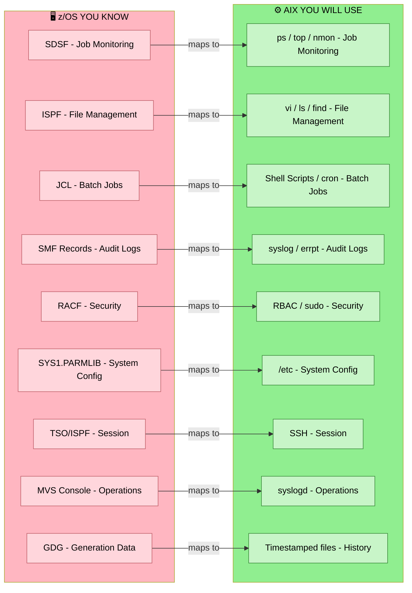

### QUICK MAPPING TABLE

| z/OS Concept | AIX Equivalent | Purpose |
|---|---|---|
| JES2 SDSF | `ps -ef` / `top` | See what's running |
| JCL `EXEC PGM=` | Shell script `./myscript.sh` | Run a job |
| `//DD` statement | File path argument | Pass data to a job |
| SYSOUT class | stdout / stderr redirect `> log` | Log output |
| `CANCEL jobname` | `kill -9 PID` | Stop a process |
| SMF type 30 record | `/var/log/syslog` | Audit trail |
| RACF `PERMIT` | `chmod` / `chown` / `sudo` | Permissions |
| ISPF editor | `vi` / `nano` | Edit files |
| `SUBMIT` | `nohup ./script.sh &` | Submit background job |
| Abend code | Exit code / core dump | Failure diagnosis |
| `LISTCAT` | `ls -la` / `find` | Find files/datasets |
| `IDCAMS REPRO` | `cp` / `dd` | Copy data |
| Initiator | Process / daemon | Runs jobs |

---

## 2. AIX CORE CONCEPTS REFRESHER

### What Makes AIX Different from Linux

```mermaid
graph TD
    UNIX[UNIX Origin - AT&T]
    UNIX --> AIX[IBM AIX - Power Systems]
    UNIX --> LINUX[Linux - x86/x64]

    AIX --> AI1[JFS2 filesystem]
    AIX --> AI2[ODM - Object Data Manager]
    AIX --> AI3[SMIT - System Mgmt Interface]
    AIX --> AI4[errpt - Error Report]
    AIX --> AI5[lsdev / cfgmgr - Device Mgmt]
    AIX --> AI6[HACMP/PowerHA - Clustering]
    AIX --> AI7[WPARs - Workload Partitions]
    AIX --> AI8[LVM - Logical Volume Mgr]

    LINUX --> L1[ext4 / xfs filesystem]
    LINUX --> L2["/etc config files"]
    LINUX --> L3[systemctl / service]
    LINUX --> L4["/var/log/messages"]
    LINUX --> L5["/dev - Device files"]
    LINUX --> L6[RHCS / Pacemaker]
    LINUX --> L7[Docker / KVM]
    LINUX --> L8[LVM similar]

    style AIX fill:#90EE90,color:#000
    style LINUX fill:#d3d3d3,color:#000
    style UNIX fill:#dbeafe,color:#000,stroke:#333
    style AI1 fill:#c8f5c8,color:#000,stroke:#3a8a3a
    style AI2 fill:#c8f5c8,color:#000,stroke:#3a8a3a
    style AI3 fill:#c8f5c8,color:#000,stroke:#3a8a3a
    style AI4 fill:#c8f5c8,color:#000,stroke:#3a8a3a
    style AI5 fill:#c8f5c8,color:#000,stroke:#3a8a3a
    style AI6 fill:#c8f5c8,color:#000,stroke:#3a8a3a
    style AI7 fill:#c8f5c8,color:#000,stroke:#3a8a3a
    style AI8 fill:#c8f5c8,color:#000,stroke:#3a8a3a
    style L1 fill:#e0e0e0,color:#000,stroke:#888
    style L2 fill:#e0e0e0,color:#000,stroke:#888
    style L3 fill:#e0e0e0,color:#000,stroke:#888
    style L4 fill:#e0e0e0,color:#000,stroke:#888
    style L5 fill:#e0e0e0,color:#000,stroke:#888
    style L6 fill:#e0e0e0,color:#000,stroke:#888
    style L7 fill:#e0e0e0,color:#000,stroke:#888
    style L8 fill:#e0e0e0,color:#000,stroke:#888
```

### AIX Storage Architecture (THINK z/OS VOLUMES)

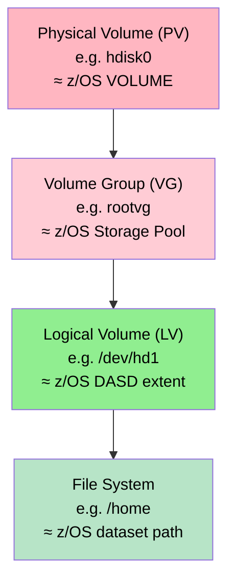

**Key LVM Commands:**

| Command | Full Example | Purpose |
|---|---|---|
| `lspv` | `lspv` | List all physical volumes and status — like LISTCAT VOL |
| `lsvg` | `lsvg` | List all volume groups |
| `lsvg -l` | `lsvg -l rootvg` | List logical volumes inside a volume group |
| `df -g` | `df -g` | Disk space in GB across all filesystems — like ADRDSSU stats |
| `lsfs` | `lsfs` | List all filesystems and their mount points |

---

## 3. AIX COMMAND CHEAT SHEET

### PROCESS MANAGEMENT (Daily Driver)

| Category | Command | Full Example | Purpose |
|---|---|---|---|
| Monitor | `ps -ef` | `ps -ef` | All running processes — like SDSF active jobs |
| Monitor | `ps -ef \| grep` | `ps -ef \| grep arsd` | Find a specific process by name |
| Monitor | `ps aux` | `ps aux --sort=-%cpu` | All processes sorted by CPU usage |
| Monitor | `top` | `top` | Live interactive process monitor (press `q` to quit) |
| Monitor | `nmon` | `nmon` | IBM's AIX performance dashboard — best AIX tool |
| Kill | `kill` | `kill 14832` | Graceful stop signal — like P command in SDSF |
| Kill | `kill -9` | `kill -9 14832` | Force kill immediately — like CANCEL DUMP in JES2 |
| Kill | `killall` | `killall arsload` | Kill all processes matching that name |
| Background | `script.sh &` | `./run_reports.sh &` | Run script in background |
| Background | `nohup` | `nohup ./run_reports.sh > /tmp/run.log 2>&1 &` | Background job that survives logout with logging |
| Background | `jobs` | `jobs` | List all background jobs in current shell |

### FILE SYSTEM OPERATIONS (Like ISPF 3.4)

| Category | Command | Full Example | Purpose |
|---|---|---|---|
| Navigate | `ls -la` | `ls -la /opt/IBM/OnDemand/logs/` | List files with permissions — like ISPF 3.4 |
| Navigate | `ls -lrt` | `ls -lrt /input/reports/` | List sorted by time, newest last |
| Navigate | `find -name` | `find /logs -name "*.log" 2>/dev/null` | Find files by name — like ISRSUPC |
| Navigate | `find -mtime` | `find /logs -mtime -1` | Files modified in last 24 hours |
| Navigate | `locate` | `locate arssyslog` | Fast find by name (uses cached index) |
| Browse | `cat` | `cat /opt/IBM/OnDemand/logs/arssyslog` | Display entire file — like ISPF BROWSE |
| Browse | `less` | `less /opt/IBM/OnDemand/logs/arssyslog` | Page through file, arrows to navigate |
| Browse | `head` | `head -50 app.log` | Show first 50 lines |
| Browse | `tail` | `tail -100 app.log` | Show last 100 lines |
| Browse | `tail -f` | `tail -f /opt/IBM/OnDemand/logs/arssyslog` | Live log follow — like SDSF ST tail mode |
| Browse | `grep` | `grep "ERROR" app.log` | Search inside file — like FIND in ISPF |
| Browse | `grep -i` | `grep -i "abend" app.log` | Case-insensitive search |
| Browse | `grep -n` | `grep -n "FATAL" app.log` | Search with matching line numbers |
| Manage | `cp` | `cp report.rpt /backup/report_20260221.rpt` | Copy file — like IDCAMS REPRO |
| Manage | `mv` | `mv report_tmp.rpt report_final.rpt` | Move or rename — like RENAME in ISPF |
| Manage | `rm` | `rm /tmp/old_report.rpt` | Delete file — like DELETE in ISPF |
| Manage | `rm -rf` | `rm -rf /tmp/old_batch_work/` | ⚠️ Delete directory recursively — DANGEROUS |
| Manage | `mkdir -p` | `mkdir -p /logs/cmod/2026/02` | Create directory and all parents |
| Manage | `chmod` | `chmod 755 /scripts/run_arsload.sh` | Set permissions rwxr-xr-x — like RACF PERMIT |
| Manage | `chown` | `chown cmod:cmod /input/reports/stmt.rpt` | Change owner and group |

### LOG ANALYSIS (Primary Production Support Tool)

| Category | Command | Full Example | Purpose |
|---|---|---|---|
| AIX System | `errpt` | `errpt` | AIX error report — IBM unique, no Linux equivalent |
| AIX System | `errpt -a` | `errpt -a \| more` | Full detailed error report, paged |
| AIX System | `errpt -j` | `errpt -j AA8AB241` | Lookup one specific error entry by ID |
| AIX System | `errpt -d H` | `errpt -d H` | Hardware errors only (disk, memory, CPU) |
| AIX System | `errpt -d S` | `errpt -d S` | Software errors only |
| AIX System | `errclear 0` | `errclear 0` | Clear ALL entries from the error log |
| AIX System | `errclear 7` | `errclear 7` | Clear entries older than 7 days |
| AIX System | `errclear -d H 0` | `errclear -d H 0` | Clear hardware-class errors only |
| Syslog | `cat syslog` | `cat /var/adm/ras/syslog` | View AIX system log — like SMF records |
| Syslog | `tail -f syslog` | `tail -f /var/adm/ras/syslog \| grep ERROR` | Live system log monitor filtered for errors |
| App Logs | `grep -E` | `grep -E "ERROR\|WARN\|FATAL" app.log` | Find all problems in one pass — like SDSF SYSOUT |
| App Logs | `grep -c` | `grep -c "ERROR" app.log` | Count total error occurrences in log |
| App Logs | `awk` | `awk '/ERROR/{print $0}' app.log` | AWK filter — print only error lines |
| App Logs | `grep + tail` | `grep "ERROR" app.log \| tail -20` | Show only the last 20 error lines |
| App Logs | `grep + date` | `grep "2026-02-21" app.log \| grep ERROR` | Errors on a specific date |
| App Logs | `zcat` | `zcat app.log.gz \| grep ERROR` | Search inside a compressed log file |

### NETWORK TROUBLESHOOTING

| Category | Command | Full Example | Purpose |
|---|---|---|---|
| Connectivity | `ping -c` | `ping -c 4 db-server.bank.internal` | Test basic connectivity, 4 pings only |
| Connectivity | `netstat -an` | `netstat -an` | All active connections — like VTAM DISPLAY NET |
| Connectivity | `netstat \| grep LISTEN` | `netstat -an \| grep LISTEN` | Show all ports the server is listening on |
| Connectivity | `netstat \| grep port` | `netstat -an \| grep :1445` | Check if CMOD port 1445 is active |
| Connectivity | `telnet` | `telnet cmod-server.bank.internal 1445` | Test if a specific port is reachable |
| Connectivity | `curl -I` | `curl -I http://cmod-server:8080/health` | Test HTTP service response headers |
| AIX Network | `ifconfig -a` | `ifconfig -a` | All network interfaces and IPs — like DISPLAY TCPIP |
| AIX Network | `entstat` | `entstat -all en0` | Ethernet adapter statistics for interface en0 |
| AIX Network | `no -o` | `no -o all` | Display all network tuning options |

### PERFORMANCE MONITORING

| Category | Command | Full Example | Purpose |
|---|---|---|---|
| CPU | `vmstat` | `vmstat 2 10` | CPU, memory and swap — every 2 sec, 10 samples |
| CPU | `sar -u` | `sar -u 2 10` | CPU utilization over time — like RMF on z/OS |
| CPU | `nmon` | `nmon` | IBM's interactive AIX performance dashboard |
| IO | `iostat` | `iostat 2 10` | Overall IO stats — every 2 sec, 10 samples |
| IO | `iostat -d` | `iostat -d 2 5` | Disk-specific IO stats |
| Memory | `sar -r` | `sar -r 2 10` | Memory usage over time |
| Memory | `svmon -G` | `svmon -G` | AIX memory summary — like RMF memory report |
| Memory | `svmon -P` | `svmon -P 14832` | Memory breakdown for a specific process PID |
| Disk | `lspv` | `lspv` | List physical volumes and utilization |
| LPAR | `lparstat -i` | `lparstat -i` | AIX-only: show LPAR configuration — entitled CPU, mode (shared/dedicated), SMT threads. No Linux equivalent. |
| LPAR | `lparstat` | `lparstat 2 10` | Live CPU entitlement and utilisation stats — every 2 sec, 10 samples |
| All-in-one | `topas` | `topas` | AIX interactive performance monitor — covers CPU, memory, disk, network in one screen (like a richer `top`) |

#### CPU Triage Model — User / Wait / Idle

> **Key insight:** Reading `vmstat` output is how you classify a performance problem in under 60 seconds. The three columns that matter are **`us`** (user%), **`wa`** (wait/I/O%), and **`id`** (idle%).

```
vmstat 1 5
# procs -----------memory---------- ---swap-- -----io---- -system-- ------cpu-----
# r  b   swpd   free   buff  cache   si   so    bi    bo   in   cs  us sy id wa st
```

| Scenario | `us` | `wa` | `id` | Root Cause | Action |
|---|---|---|---|---|---|
| **CPU Bottleneck** | High | Low | < 5% | App/code consuming CPU | `ps -ef`, `top`, check runaway process |
| **I/O Bottleneck** | Low | High (>20%) | Low | Disk too slow — CPU stuck waiting | `iostat`, check storage pools, run `lspv` |
| **Healthy System** | Low | Low | > 20% | Server has headroom | No action needed |
| **False alarm** | Low | Low | High | User complains but CPU is idle | Pivot to **network** or **DB locking** |

**Key Insight:**
> If a user reports slowness but `vmstat` shows Idle% above 20%, the CPU is not the problem. The correct next step is to pivot to network latency or DB2 lock contention diagnostics. The `cmod_shift_report.sh` script explicitly captures this guardrail logic.

---

#### 🚨 Danger Zone Thresholds — When to Stop Watching and Start Acting

> These are the hard numbers that turn a `vmstat` reading into a **priority incident**. Match the symptom to the priority level and respond accordingly.

##### Priority Level Reference

| Badge | Priority | Meaning | Response Time |
|---|---|---|---|
| <span style="background:#dc2626;color:#fff;padding:2px 8px;border-radius:4px;font-weight:bold;">P1 CRITICAL</span> | P1 | System failing or imminent collapse | **Immediate — act now** |
| <span style="background:#ea580c;color:#fff;padding:2px 8px;border-radius:4px;font-weight:bold;">P2 HIGH</span> | P2 | Severe degradation, SLA at risk | **Within minutes** |
| <span style="background:#ca8a04;color:#fff;padding:2px 8px;border-radius:4px;font-weight:bold;">P3 MEDIUM</span> | P3 | Noticeable performance decline | **Within the hour** |
| <span style="background:#16a34a;color:#fff;padding:2px 8px;border-radius:4px;font-weight:bold;">P4 HEALTHY</span> | P4 | Normal operating range | **Monitor, no action** |

---

##### Threshold Triggers

<span style="background:#dc2626;color:#fff;padding:2px 8px;border-radius:4px;font-weight:bold;">P1 CRITICAL</span> — **`Wait% (wa) > 20%` sustained for more than a few minutes**

> The CPU is stalled — it has work to do but is blocked waiting for disk I/O to complete. CMOD report storage cannot keep up with incoming data requests. This is an active **storage bottleneck** and will degrade or freeze report retrieval for end users.
>
> **Immediate actions:** `iostat -d 2 10` → identify the saturated disk → escalate to storage team.

---

<span style="background:#dc2626;color:#fff;padding:2px 8px;border-radius:4px;font-weight:bold;">P1 CRITICAL</span> — **`Idle% (id) < 10%`**

> The server has effectively run out of headroom. Any sudden spike — a new batch load, a user query burst, or a scheduled cron job — can cause the system to hang or crash entirely. There is no buffer left.
>
> **Immediate actions:** `ps aux --sort=-%cpu | head -20` → identify and assess top consumers → consider deferring non-critical batch jobs.

---

<span style="background:#ea580c;color:#fff;padding:2px 8px;border-radius:4px;font-weight:bold;">P2 HIGH</span> — **`User% + System% (us + sy) > 80%`**

> The CPU itself is the bottleneck. User-space applications or OS kernel operations are consuming almost all available processing power. CMOD indexing, `arsload`, or a runaway process is the likely culprit.
>
> **Actions within minutes:** `top` or `ps aux --sort=-%cpu` → identify the offending process → decide kill, renice, or escalate.

---

##### Bottleneck Diagnosis Matrix

> Use `vmstat 2 10` and map your readings to the correct priority.

| <span style="font-weight:bold;">Priority</span> | Scenario | `us` User% | `wa` Wait% | `id` Idle% | Diagnosis | First Command |
|---|---|---|---|---|---|---|
| <span style="background:#16a34a;color:#fff;padding:2px 6px;border-radius:4px;font-weight:bold;">P4</span> | Healthy | ~20% | 0–2% | ~78% | System has headroom — no action needed | Continue monitoring |
| <span style="background:#ea580c;color:#fff;padding:2px 6px;border-radius:4px;font-weight:bold;">P2</span> | CPU Bound | ~85% | ~5% | ~10% | CPU overloaded — too many processes competing for cycles | `ps aux --sort=-%cpu` |
| <span style="background:#dc2626;color:#fff;padding:2px 6px;border-radius:4px;font-weight:bold;">P1</span> | I/O Bound | ~10% | ~40% | ~50% | Storage bottleneck — CPU is mostly idle but stuck waiting for disk | `iostat -d 2 5` |
| <span style="background:#ea580c;color:#fff;padding:2px 6px;border-radius:4px;font-weight:bold;">P2</span> | Locked / Hung | ~0% | ~0% | ~100% | Paradox: 100% idle yet no response — points to a **network outage or DB lock** *outside* the CPU entirely | `netstat -an` → check DB2 locks |

> **Remember:** A fully idle CPU with a non-responsive system is not a CPU problem. It is almost always a **network partition or database lock** that has frozen the application layer while the OS itself sits idle. Do not chase CPU metrics in this scenario.

---

### USER & PERMISSION MANAGEMENT

| Category | Command | Full Example | Purpose |
|---|---|---|---|
| Users | `whoami` | `whoami` | Show current user — like DISPLAY USERID |
| Users | `id` | `id cmodadm` | Show user ID, primary group and all groups |
| Users | `who` | `who` | Who is currently logged on — like DISPLAY ACTIVE |
| Users | `last` | `last \| head -20` | Recent login history — like SMF type 30 |
| Users | `lsuser ALL` | `lsuser ALL` | List all local users (AIX only) — like LISTUSER in RACF |
| Users | `mkuser` | `mkuser cmodadm` | Create a new user — like ADDUSER in RACF |
| Users | `passwd` | `passwd cmodadm` | Set or change a user password — like ALTUSER PASSWORD |
| Users | `su -` | `su - cmodadm` | Switch to another user with their environment |
| Users | `sudo` | `sudo systemctl restart arsd` | Run a command as root — like RACF SPECIAL attribute |
| Permissions | `chmod 755` | `chmod 755 /scripts/run_arsload.sh` | `rwxr-xr-x` — executable scripts (owner+group can run) |
| Permissions | `chmod 644` | `chmod 644 /config/cmod.conf` | `rw-r--r--` — standard config and data files |
| Permissions | `chmod 600` | `chmod 600 /etc/cmod/.credentials` | `rw-------` — sensitive files, owner only |
| Permissions | `chown` | `chown cmod:cmod /input/reports/stmt.rpt` | Change file owner and group — like RACF PERMIT |

### CRON JOB SCHEDULING

> **How crond works in AIX** — identical on Linux WSL emulation.
> 1. `crond` is the daemon responsible for starting jobs at the right time.
> 2. `crond` starts automatically at system boot.
> 3. `crond` re-reads crontab files every **60 seconds** — changes take effect within 1 minute.
> 4. Every user has the right to schedule their own jobs via their personal crontab.
> 5. **`/etc/cron.deny`** is present by default — users listed here are blocked from using cron.
> 6. **`/etc/cron.allow`** does NOT exist by default — create it to whitelist specific users only.

#### Crontab Field Format
```
# ┌─ minute     (0–59)
# │ ┌─ hour       (0–23)
# │ │ ┌─ day of month (1–31)
# │ │ │ ┌─ month      (1–12)
# │ │ │ │ ┌─ day of week  (0–7, 0 and 7 = Sunday)
# │ │ │ │ │
  * * * * *  /path/to/command
```

#### Cron Commands — Step by Step

| Step | Command | Purpose |
|---|---|---|
| **1. Check crond is running** | `ps -ef \| grep crond` | Confirm the cron daemon is active |
| **2. View your crontab** | `crontab -l` | List your current scheduled jobs |
| **3. Edit your crontab** | `crontab -e` | Opens vi editor — add/edit/remove jobs |
| **4. Remove your crontab** | `crontab -r` | Deletes ALL your cron jobs — use with care |
| **5. View another user's crontab** (root) | `crontab -l -u cmodadm` | List cmod admin's jobs |
| **6. Edit another user's crontab** (root) | `crontab -e -u cmodadm` | Edit jobs for a specific user |
| **7. Check cron.deny** | `cat /etc/cron.deny` | See which users are blocked from cron |
| **8. Check cron logs** | `grep CRON /var/log/syslog` | See what cron ran and when |
| **9. Check cron logs (AIX-style)** | `errpt -a \| grep -i cron` | Filter error report for cron events |

#### Common Cron Schedule Examples
```bash
# Run arsload every night at 2:00 AM
0 2 * * * /scripts/run_arsload.sh >> /logs/arsload.log 2>&1

# Run every 30 minutes
*/30 * * * * /scripts/check_arsd.sh

# Run Mon–Fri at 6:00 AM (weekday batch)
0 6 * * 1-5 /scripts/morning_batch.sh >> /logs/batch.log 2>&1

# Run on the 1st of every month at midnight
0 0 1 * * /scripts/monthly_report.sh

# Run every Sunday at 11:00 PM (weekly cleanup)
0 23 * * 0 /scripts/weekly_cleanup.sh
```

#### Access Control Files
```bash
# Block a specific user from cron
echo "baduser" >> /etc/cron.deny

# Create cron.allow to whitelist only specific users (disables cron.deny)
echo "cmodadm" > /etc/cron.allow
echo "root"    >> /etc/cron.allow
```

---

## 4. IBM OnDemand / CMOD

> **CMOD = Content Manager OnDemand** — this is the big differentiator for this job. Know it well.

### What Is CMOD?

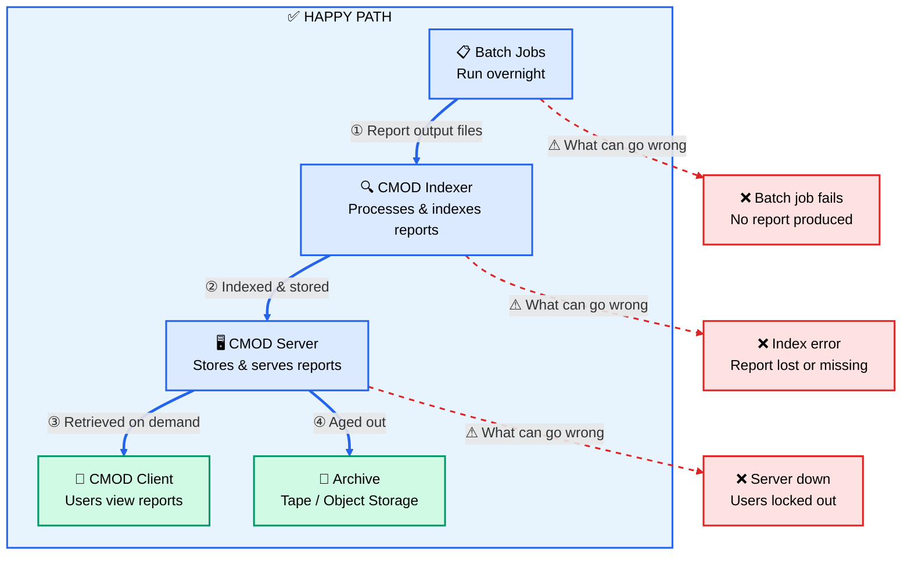

### CMOD Architecture Components

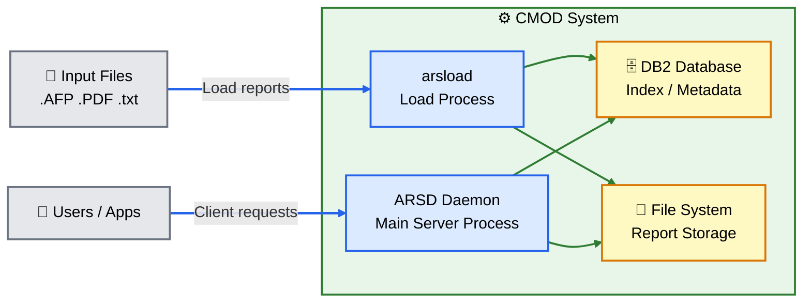

### CMOD Key Concepts - Memorize

| Term | What It Is | z/OS Equivalent |
|---|---|---|
| **Application Group** | Logical container for reports | GDG Base |
| **Application** | Specific report type | GDG Generation |
| **Folder** | User's view/search saved search | ISPF saved panel |
| **Indexer** | Parses & indexes report content | DFSMS catalog |
| **ARSD** | Main CMOD daemon | JES2 subsystem |
| **arsload** | Loads reports INTO CMOD | IDCAMS DEFINE |
| **arsadmin** | Admin CLI | ISPF 3.4 admin |
| **Instance** | CMOD server instance | LPAR |

### CMOD Troubleshooting Cheat Sheet

| Category | Command | Full Example | Purpose |
|---|---|---|---|
| Status | `ps \| grep arsd` | `ps -ef \| grep arsd` | Check if CMOD ARSD daemon is running |
| Status | `ps \| grep arsload` | `ps -ef \| grep arsload` | Check if an arsload job is currently in progress |
| Logs | `ls -lrt` | `ls -lrt /opt/IBM/OnDemand/logs/` | List CMOD log files sorted by most recent |
| Logs | `tail -f` | `tail -f /opt/IBM/OnDemand/logs/arssyslog` | Live CMOD log monitor |
| Logs | `grep errors` | `grep "ERROR" /opt/IBM/OnDemand/logs/arssyslog \| tail -50` | Last 50 errors from CMOD system log |
| Admin | `arsadmin query server` | `arsadmin query server` | Check overall CMOD server status |
| Admin | `arsadmin query application` | `arsadmin query application STMTS` | Query a specific application group |
| Admin | `arsadmin query load` | `arsadmin query load -g STMTS` | Check recent load history for an application group |
| Load | `arsload` | `arsload -I CMOD1 -g STMTS -A STMT_MONTHLY stmt_202602.rpt` | Manually load a report file into CMOD (`-I` instance, `-g` group, `-A` application) |

### CMOD Problem Flow

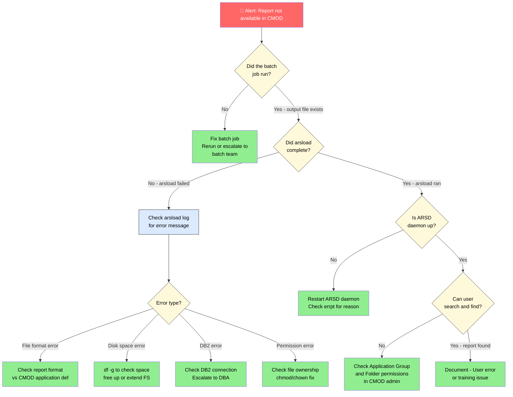

---

## 5. PRODUCTION SUPPORT PLAYBOOK

### Incident Response Flow (Banking Context)

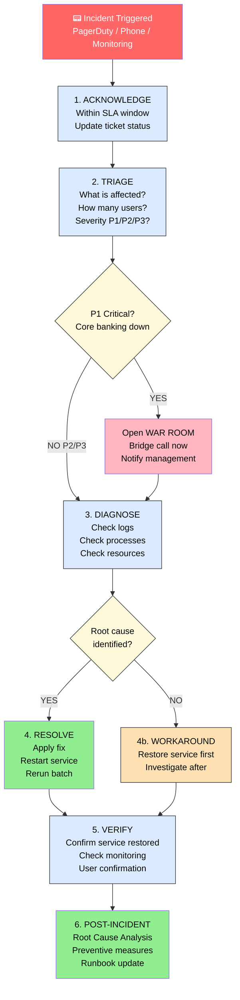

### Diagnostic Command Sequence — First 5 Minutes

> **Production entry point:** In a banking environment, every step below is preceded by a **CyberArk PSM session checkout**. You authenticate through the CyberArk vault, open a recorded PSM tunnel to the AIX server, and only then begin monitoring. Every keystroke is audit-logged against your ticket number.

| Step | Command | Full Example | What To Look For |
|---|---|---|---|
| **0. CyberArk access** | PVWA login | `https://cyberark.bank.internal` | Check out `cmodadm` account, open PSM tunnel — ticket number required |
| **1. Right server?** | `hostname` | `hostname` | Confirm you are on the correct server |
| **1. Right server?** | `uptime` | `uptime` | Load average — if > CPU count, system is overloaded |
| **2. System healthy?** | `df -g` | `df -g` | Any filesystem at 100%? Full disk = #1 incident cause |
| **2. System healthy?** | `vmstat` | `vmstat 1 5` | CPU steal, memory free, swap activity |
| **2. System healthy?** | `errpt` | `errpt \| head -20` | Any recent hardware or OS errors? |
| **3. App running?** | `ps -ef \| grep` | `ps -ef \| grep arsd` | Is the CMOD ARSD daemon process present? |
| **4. Check logs** | `tail + grep` | `tail -100 /opt/IBM/OnDemand/logs/arssyslog \| grep -E "ERROR\|FATAL"` | What errors appear at the bottom of the log? |
| **4. Check logs** | `errpt -a` | `errpt -a \| head -50` | Any system-level errors tied to the incident time? |
| **5. Network?** | `netstat` | `netstat -an \| grep LISTEN` | Is the application port still listening? |
| **5. Network?** | `ping` | `ping -c 4 db-server.bank.internal` | Can the app server reach the database? |
| **6. Filesystem?** | `ls -lrt` | `ls -lrt /input/reports/` | Did input files arrive on time? |
| **6. Filesystem?** | `du -sh` | `du -sh /opt/IBM/OnDemand/logs/*` | Which log directories are consuming most space? |

### Root Cause Analysis (RCA) Template

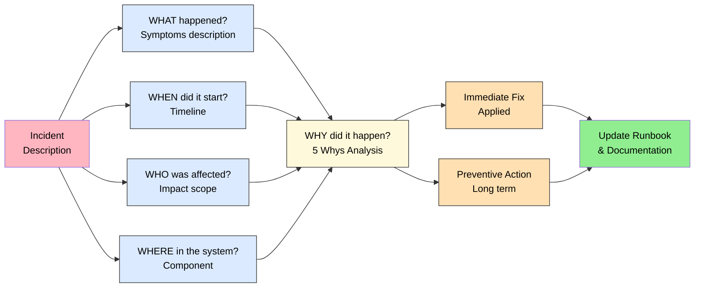

---

## 6. SRE MINDSET + ITIL PROCESSES

### The SRE Pillars

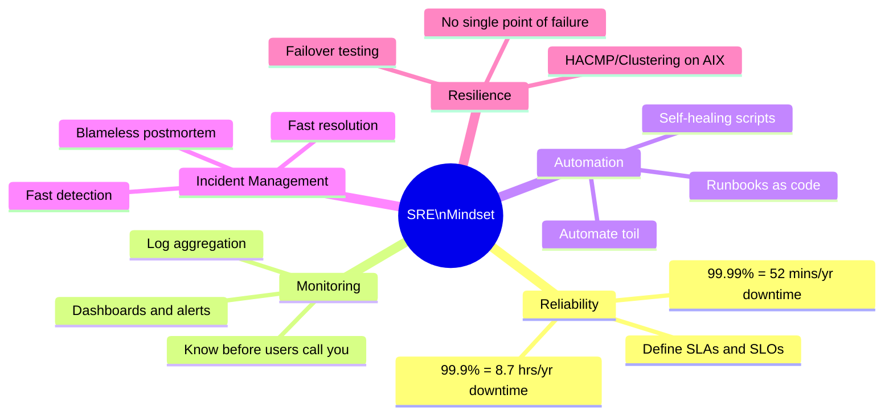

### ITIL Process Quick Reference (Banks LOVE ITIL)

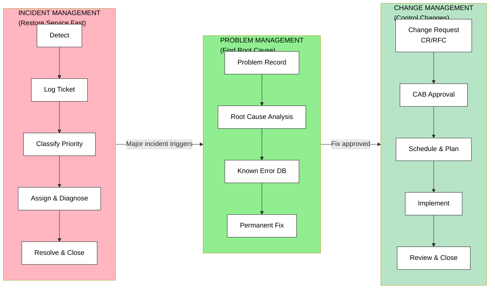

### Key ITIL Terms to Know in Banking

| Term | Definition | Banking Example |
|---|---|---|
| **SLA** | Service Level Agreement | "Batch must complete by 6am" |
| **SLO** | Service Level Objective | "99.95% availability" |
| **RTO** | Recovery Time Objective | "System restored within 2 hours" |
| **RPO** | Recovery Point Objective | "No more than 15 min data loss" |
| **P1/SEV1** | Highest priority incident | Core banking system down |
| **P2/SEV2** | Major incident | CMOD unavailable for all users |
| **CAB** | Change Advisory Board | Approves production changes |
| **RFC** | Request For Change | Change ticket submitted to CAB |
| **KEDB** | Known Error Database | Documented known bugs + workarounds |
| **Runbook** | Step-by-step fix guide | "How to restart CMOD" doc |
| **SOP** | Standard Operating Procedure | Daily operational checklist |
| **PIR** | Post Incident Review | Blameless postmortem meeting |

### Change Management Flow (Banking is STRICT about this)

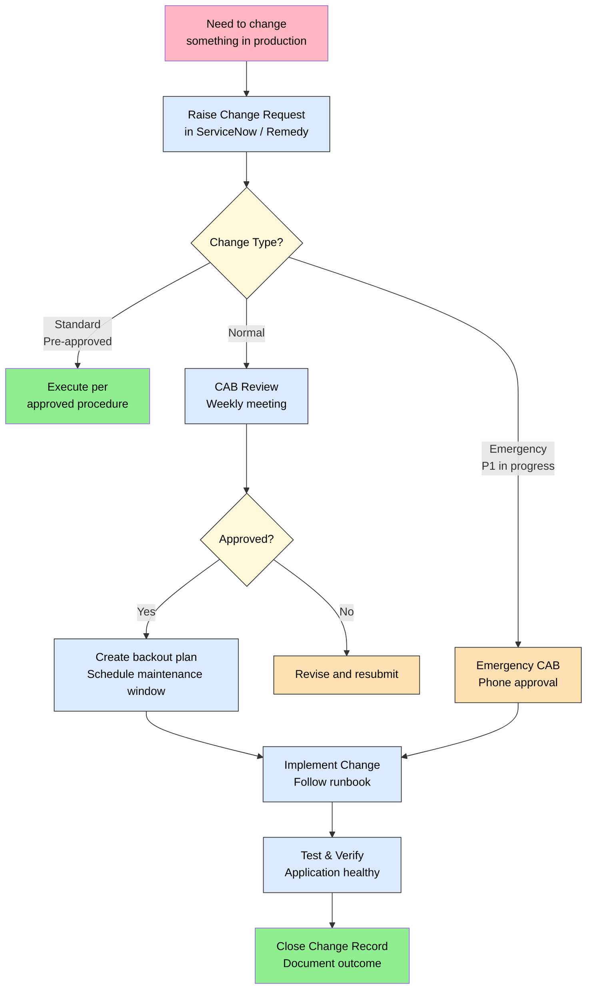

---

## 7. BANKING/MISSION-CRITICAL PATTERNS

### Batch Processing Flow in Banking

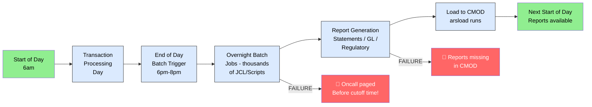

### High Availability on AIX (PowerHA / HACMP)

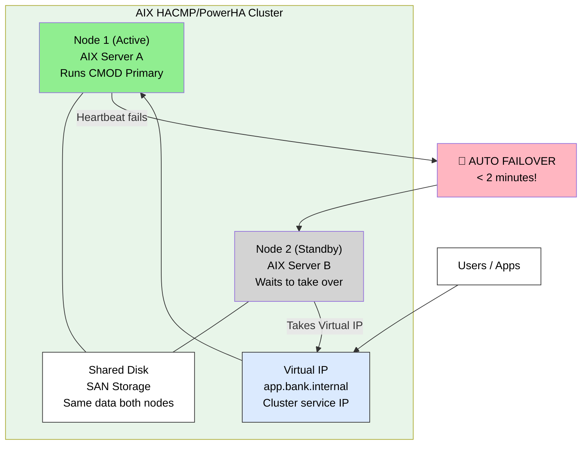

**Key HACMP commands to know:**

| Command | Full Example | Purpose |
|---|---|---|
| `clstat` | `clstat` | Cluster status overview — THE most important HACMP command |
| `clfindres` | `clfindres -r CMOD_RG` | Find and display a specific cluster resource group |
| `clRGinfo` | `clRGinfo` | Resource group info — which node currently owns each group |
| `lssrc -g cluster` | `lssrc -g cluster` | List all cluster subsystem services and their state |
| `smit hacmp` | `smit hacmp` | SMIT menu for HACMP administration — like ISPF for clustering |

### CyberArk PAM — Production Access in Banking

> Banks mandate CyberArk (Privileged Access Management) for all production server access. Understanding this workflow is a baseline expectation in banking SRE environments.

**What CyberArk PSM does:**
- Every SSH session to a production AIX server is **proxied through a CyberArk Privileged Session Manager (PSM)** vault.
- The session is **fully recorded** (keystroke + video) — every command you run is logged for regulatory audit.
- Credentials are **checked out** from the vault automatically; engineers never see the actual root password.
- Sessions are **time-limited** and tied to a change/incident ticket number.

**How it changes your workflow:**
```bash
# Normal SSH (dev/test only)
ssh hjoseph@aix-dev-server01

# Production SSH via CyberArk PSM (what you'll actually do at a bank)
# 1. Log into CyberArk web vault or PVWA: https://cyberark.bank.internal
# 2. Request checkout for: prod-aix-cmodserver01 / cmodadm
# 3. CyberArk opens a proxied SSH session or RDP tunnel
# 4. Your session is recorded end-to-end for audit
# 5. At end of change window — release the account back to vault
```

**Key benefits of CyberArk PAM:**
- **Security:** Prevents password reuse and provides a full audit trail
- **Compliance:** Satisfies regulatory requirements for production access
- **Accountability:** Every action is tied to a specific change ticket
- **Automation:** Integrates with change management systems

> **Note:** The `cmod_shift_report.sh` health-check script is designed to run through a CyberArk PSM session. Its non-interactive design — no embedded passwords, environment variables for host/user — makes it CyberArk-PSM-compatible out of the box, satisfying the full keystroke audit logging requirement.

| CyberArk Term | Meaning |
|---|---|
| **PAM** | Privileged Access Management — the overall discipline |
| **PSM** | Privileged Session Manager — the proxy that records sessions |
| **PVWA** | Password Vault Web Access — the web UI to check out accounts |
| **CPM** | Central Policy Manager — auto-rotates passwords on schedule |
| **Safe** | A logical container of accounts in the vault (like a RACF group) |
| **Account checkout** | Temporary exclusive access to a privileged account |

---

## QUICK REFERENCE — AIX vs z/OS CHEAT SHEET

```
╔══════════════════════════════════════════════════════════════════════╗
║           YOU KNOW THIS          →       NOW LEARN THIS             ║
╠══════════════════════════════════════════════════════════════════════╣
║ SDSF ST (active jobs)            → ps -ef                           ║
║ SDSF P (purge job)               → kill -9 PID                      ║
║ SDSF BROWSE sysout               → tail -f logfile                  ║
║ FIND in ISPF                     → grep "string" file               ║
║ ISPF 3.4 list datasets           → ls -la /path/                    ║
║ ISPF editor                      → vi filename                      ║
║ SMF records                      → /var/log/syslog + errpt          ║
║ RACF PERMIT                      → chmod + chown                    ║
║ RACF LISTUSER                    → lsuser ALL                       ║
║ JCL SUBMIT                       → nohup ./script.sh &              ║
║ IDCAMS REPRO                     → cp source dest                   ║
║ CANCEL with DUMP                 → kill -9 PID                      ║
║ D A,ALL (display jobs)           → ps aux                           ║
║ RMF performance                  → nmon / sar                       ║
║ LISTCAT                          → find / -name "filename"          ║
║ SYS1.LOGREC                      → errpt -a                         ║
║ DISPLAY TCPIP                    → ifconfig -a + netstat -an        ║
║ GDG                              → Timestamped files                ║
║ z/OS PARMLIB                     → /etc directory                   ║
║ JES2 subsystem                   → daemon process                   ║
╚══════════════════════════════════════════════════════════════════════╝

╔══════════════════════════════════════════════════════════════════════╗
║                    CMOD QUICK REFERENCE                             ║
╠══════════════════════════════════════════════════════════════════════╣
║ CMOD = Content Manager OnDemand = Report Archiving System           ║
║ arsd      = Main daemon (must be running)                           ║
║ arsload   = CLI to load reports into CMOD                           ║
║ arsadmin  = Admin CLI                                               ║
║ AppGroup  = Container for report type                               ║
║ Folder    = User's saved search view                                ║
║ DB2       = Stores index/metadata                                   ║
║                                                                     ║
║ CHECK ORDER WHEN REPORT MISSING:                                    ║
║  1) Did batch job run?  → ls -lrt /output/                         ║
║  2) Did arsload work?   → Check arsload log                         ║
║  3) Is arsd running?    → ps -ef | grep arsd                        ║
║  4) Disk space OK?      → df -g                                     ║
║  5) User permissions?   → arsadmin query folder                     ║
╚══════════════════════════════════════════════════════════════════════╝

╔══════════════════════════════════════════════════════════════════════╗
║                  FIRST 5 MINS OF ANY INCIDENT                       ║
╠══════════════════════════════════════════════════════════════════════╣
║  hostname          → confirm I'm on right server                    ║
║  uptime            → load average healthy?                          ║
║  df -g             → any filesystem 100% full?                      ║
║  errpt | head -20  → any system errors?                             ║
║  ps -ef | grep APP → is the process running?                        ║
║  tail -100 app.log | grep ERROR → what does log say?               ║
╚══════════════════════════════════════════════════════════════════════╝
```

---

## SUMMARY — VALUE PROPOSITION

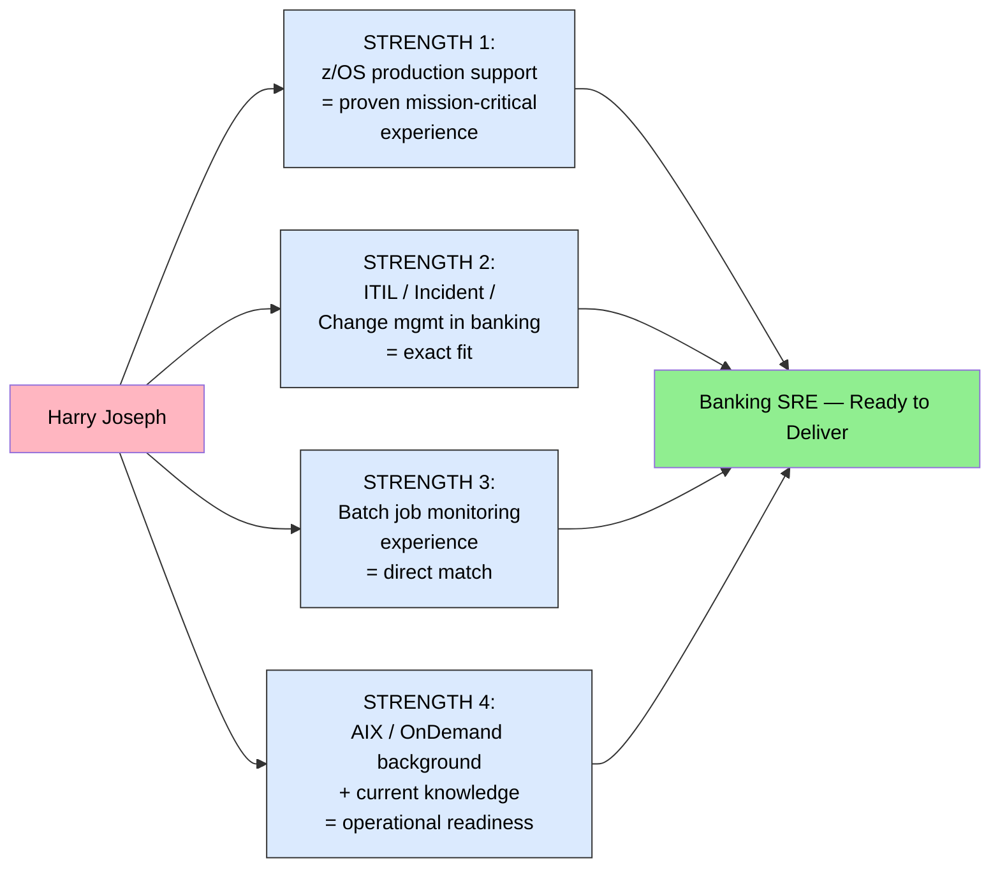

### Key Technical Positioning

1. **z/OS and AIX skills are complementary** — the operational model, tooling, and mindset transfer directly across platforms.
2. **CMOD is the report backbone** — reliability means reports are available to the business when they are needed, every time.
3. **In banking SRE, mean-time-to-restore is the measure that matters** — speed of diagnosis and resolution is the core deliverable.

---
*Document prepared: February 2026 | Role: AIX/OnDemand SRE - Banking Platform*
