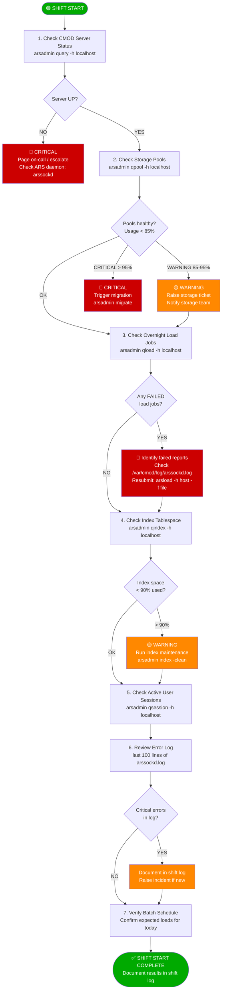
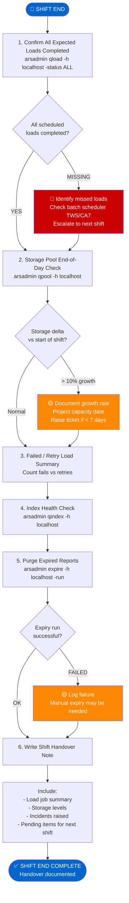
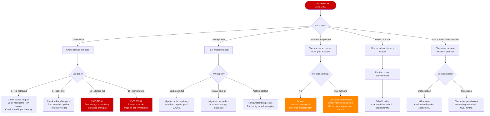
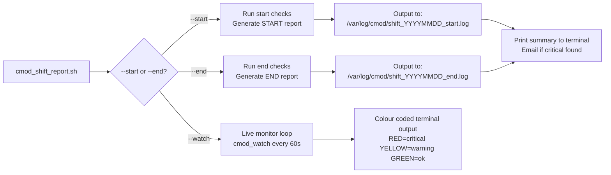
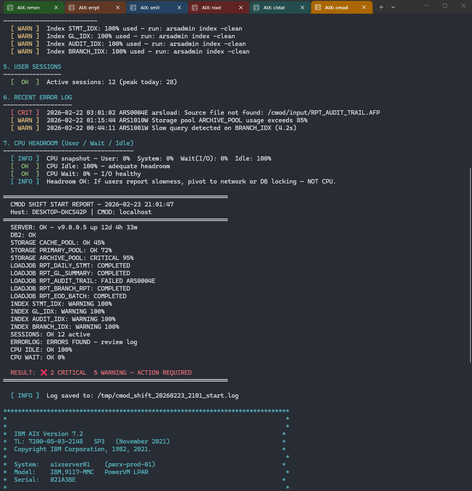

# RUNBOOK — IBM Content Manager OnDemand (CMOD) Shift Operations

| Field | Detail |
|---|---|
| **Document ID** | RB-CMOD-001 |
| **Version** | 1.0 |
| **Owner** | AIX SRE — Harry Joseph |
| **Platform** | AIX / IBM Content Manager OnDemand (CMOD) v9.x+ |
| **Scope** | Shift start and shift end health check procedures |
| **Last Reviewed** | February 2026 |

> **Purpose:** This runbook defines the mandatory health check sequence to be executed at the start and end of every operational shift for CMOD environments. It covers server status, storage pool validation, overnight load job verification, index health, and shift handover documentation requirements.

---

## What is CMOD?

IBM Content Manager OnDemand is an enterprise report management and archiving system used in banking to:
- Ingest, index and archive reports from Mainframe batch jobs
- Serve reports to business users (statements, GL reports, audit logs)
- Manage retention, expiry and storage pools
- Integrate with Mainframe JCL batch scheduling (TWS/OPC/CA7)

---

## Shift Start Health Check Flow



---

## Shift End Health Check Flow



---

## Error Decision Tree



---

## Expected Errors Reference Table

| Error Code | Command | Meaning | Immediate Action | Escalate? |
|---|---|---|---|---|
| `ARS0004E` | arsload | Source file not found | Check FTP from Mainframe | Yes if recurring |
| `ARS0008E` | arsload | Index tablespace full | `arsadmin index -clean` | Yes if > 90% |
| `ARS0012E` | arsload | Storage pool full | Run expire/migrate | Yes — always |
| `ARS0016E` | arsload | Cannot connect to server | Restart arssockd | Yes — P1 |
| `ARS0020E` | arsadmin | DB2 connection failure | Check DB2 instance | Yes — P1 |
| `ARS0032E` | arsadmin | License exceeded | Log and notify vendor | Yes |
| `ARS1001W` | arssockd.log | Slow query warning | Check index health | No — monitor |
| `ARS1010W` | arssockd.log | Storage pool >80% | Plan migration | Yes if > 85% |
| `ARS2001E` | arssockd.log | Authentication failure | Check PAM/LDAP config | Yes if affecting users |
| `ARS9999E` | any | Unexpected internal error | Collect logs, restart | Yes — always |

---

## Shift Report Script Concept



---

## Sample Output — Shift Start Report (Live Environment)

> Screenshot captured from a live shift start execution on `DESKTOP-DKCS42P | CMOD: localhost`  
> Run timestamp: **2026-02-23 21:01:47** | AIX 7.2 TL7 SP3 | IBM,9117-MMC PowerVM LPAR

> **To display this image:** Save the screenshot file as `images/cmod_shift_start_output.png` in the same directory as this runbook.



### Reading the Output — Section by Section

#### Index Tablespace (Section 4 — WARNINGS)
```
[ WARN ]  Index STMT_IDX:   100% used – run: arsadmin index -clean
[ WARN ]  Index GL_IDX:     100% used – run: arsadmin index -clean
[ WARN ]  Index AUDIT_IDX:  100% used – run: arsadmin index -clean
[ WARN ]  Index BRANCH_IDX: 100% used – run: arsadmin index -clean
```
All four index tablespaces have hit **100% capacity**. This is a P2 condition — report loading will begin failing if these are not cleaned before the next batch cycle. Immediate action: run `arsadmin index -clean` for each affected index.

#### User Sessions (Section 5 — OK)
```
[ OK ]  Active sessions: 12 (peak today: 28)
```
12 active sessions at shift start — within normal range. Peak of 28 is consistent with business hours activity. No stale sessions require intervention.

#### Recent Error Log (Section 6 — CRITICAL + WARNINGS)
```
[ CRIT ]  2026-02-22 03:01:02  ARS0004E arsload: Source file not found: /cmod/input/RPT_AUDIT_TRAIL.AFP
[ WARN ]  2026-02-22 01:15:44  ARS1010W Storage pool ARCHIVE_POOL usage exceeds 85%
[ WARN ]  2026-02-22 00:44:11  ARS1001W Slow query detected on BRANCH_IDX (4.2s)
```
| Entry | Severity | Required Action |
|---|---|---|
| `ARS0004E` — `RPT_AUDIT_TRAIL.AFP` not found | **CRITICAL** | Verify Mainframe FTP transfer for audit trail report. Check `/cmod/input/` on source. Raise incident — audit reports are regulatory. |
| `ARS1010W` — `ARCHIVE_POOL` > 85% | WARNING | Raise storage ticket. Project capacity date. Run `arsadmin expire` if within policy. |
| `ARS1001W` — Slow query on `BRANCH_IDX` (4.2s) | WARNING | Correlates with index at 100%. Run `arsadmin index -clean` on `BRANCH_IDX` first. |

#### CPU Headroom (Section 7 — ALL OK)
```
[ INFO ]  CPU snapshot – User: 0%  System: 0%  Wait(I/O): 0%  Idle: 100%
[ OK   ]  CPU Idle: 100% – adequate headroom
[ OK   ]  CPU Wait: 0% – I/O healthy
[ INFO ]  Headroom OK: If users report slowness, pivot to network or DB locking – NOT CPU.
```
CPU is fully idle — no compute bottleneck. The `wait%` of 0% also rules out an I/O bottleneck. Any user-reported slowness during this shift must be directed toward **network latency or DB2 lock investigation**, not CPU.

#### Shift Summary Block
```
SERVER:           OK – v9.0.0.5 up 12d 4h 33m
DB2:              OK
STORAGE CACHE_POOL:    OK 45%
STORAGE PRIMARY_POOL:  OK 72%
STORAGE ARCHIVE_POOL:  CRITICAL 95%        ← Requires immediate action
LOADJOB RPT_DAILY_STMT:   COMPLETED
LOADJOB RPT_GL_SUMMARY:   COMPLETED
LOADJOB RPT_AUDIT_TRAIL:  FAILED ARS0004E  ← Source file missing — raise incident
LOADJOB RPT_BRANCH_RPT:   COMPLETED
LOADJOB RPT_EOD_BATCH:    COMPLETED
INDEX STMT_IDX:    WARNING 100%
INDEX GL_IDX:      WARNING 100%
INDEX AUDIT_IDX:   WARNING 100%
INDEX BRANCH_IDX:  WARNING 100%
SESSIONS:          OK 12 active
ERRORLOG:          ERRORS FOUND – review log
CPU IDLE:          OK 100%
CPU WAIT:          OK 0%
```

#### Final Result
```
RESULT: ✗ 2 CRITICAL   5 WARNING – ACTION REQUIRED
```

| Priority | Item | Action |
|---|---|---|
| **CRITICAL** | `STORAGE ARCHIVE_POOL` at 95% | Run `arsadmin expire -h localhost -run` or trigger migration. Escalate to storage team. |
| **CRITICAL** | `LOADJOB RPT_AUDIT_TRAIL` — `ARS0004E` | Verify Mainframe FTP of `/cmod/input/RPT_AUDIT_TRAIL.AFP`. Resubmit with `arsload` once file confirmed present. Raise incident — audit trail is a regulatory report. |
| WARNING ×4 | All index tablespaces at 100% | Run `arsadmin index -clean` for `STMT_IDX`, `GL_IDX`, `AUDIT_IDX`, `BRANCH_IDX` before next batch load window. |
| WARNING | `ARCHIVE_POOL` > 85% logged in error log | Covered by CRITICAL above. |

> **Shift log saved to:** `/tmp/cmod_shift_20260223_2101_start.log`  
> This file is the auditable record of the shift start state. Attach to any incident tickets raised from this check.

---

## Key CMOD Commands Cheat Sheet

> These are the **real `arsadmin` production commands** this cheat sheet documents. The companion script [`cmod_shift_report.sh`](cmod_shift_report.sh) simulates these exact commands in a WSL/lab environment using internal stub functions — each stub includes a comment showing the real command it replaces. When running this report against an actual CMOD server, these are the commands executing under the hood.

```bash
# Server status
arsadmin query -h localhost

# Storage pools
arsadmin qpool -h localhost

# Load job status (today)
arsadmin qload -h localhost -date today

# Load job status (all)
arsadmin qload -h localhost -status ALL

# Active user sessions
arsadmin qsession -h localhost

# Index health
arsadmin qindex -h localhost

# Expire old reports (dry run first)
arsadmin expire -h localhost -preview
arsadmin expire -h localhost -run

# Reload a failed report
arsload -h localhost -f /cmod/input/report.AFP -rpt REPORTNAME

# Kill stale session
arsadmin endsession -h localhost -sessionid SESSION_ID

# Restart CMOD server (AIX)
stopsrc -s arssockd
startsrc -s arssockd

# Tail live log
tail -f /var/cmod/log/arssockd.log | grep -iE "error|warn|fail|load"
```

---

## Why Run This at Shift Start AND End?

| Shift Start | Shift End |
|---|---|
| Confirms overnight batch completed clean | Confirms your shift's loads all succeeded |
| Catches storage issues before business hours | Documents storage growth for capacity planning |
| Sets your incident baseline | Creates handover evidence (CYA) |
| Identifies any P1s to pick up immediately | Flags anything the next shift must watch |

---

## Document Notes

> This runbook was developed to codify the CMOD shift operations framework, covering server status, storage pools, load job validation, and index health. The `cmod_shift_report.sh` script automates this checklist, outputs a timestamped shift log, and colour-codes critical vs warning conditions. In a regulated banking environment, maintaining a documented handover trail is a mandatory requirement for incident management and regulatory audit compliance.
